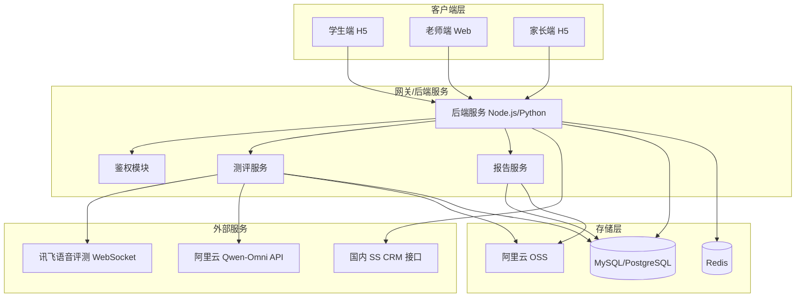
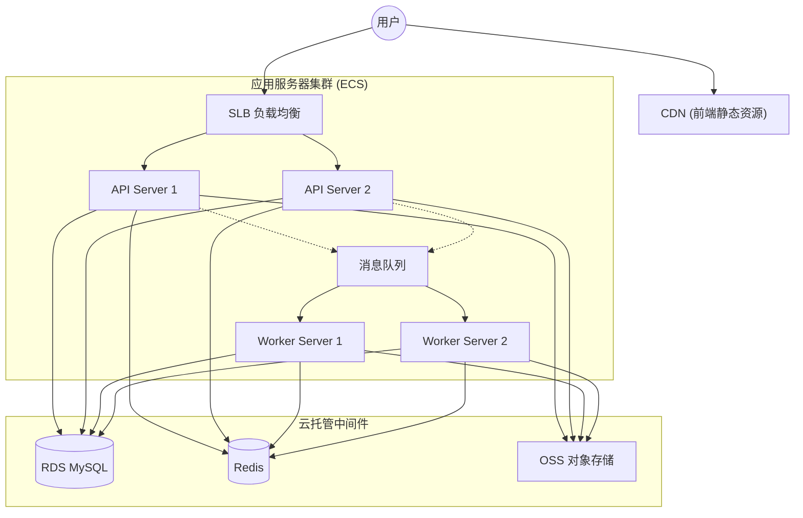
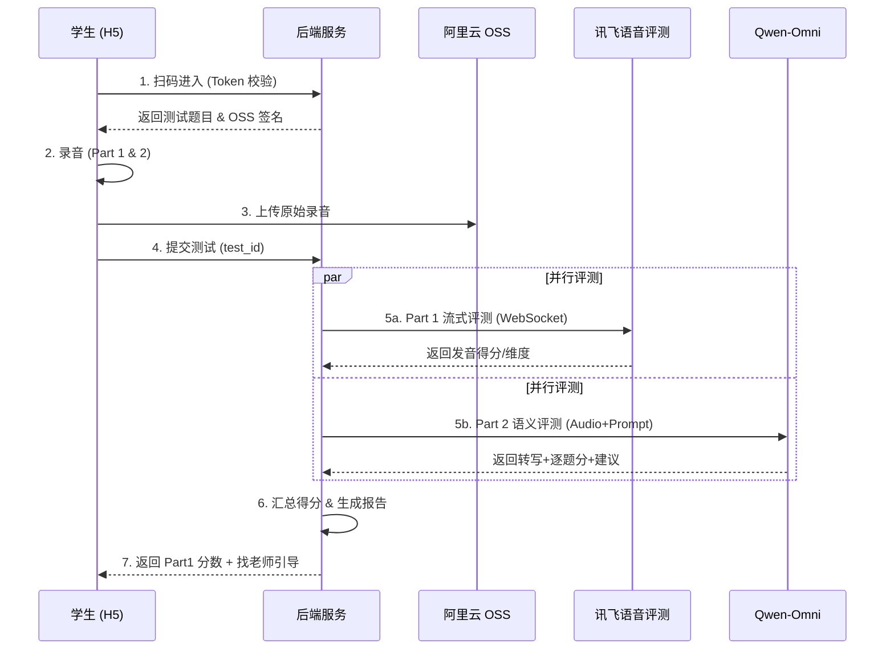
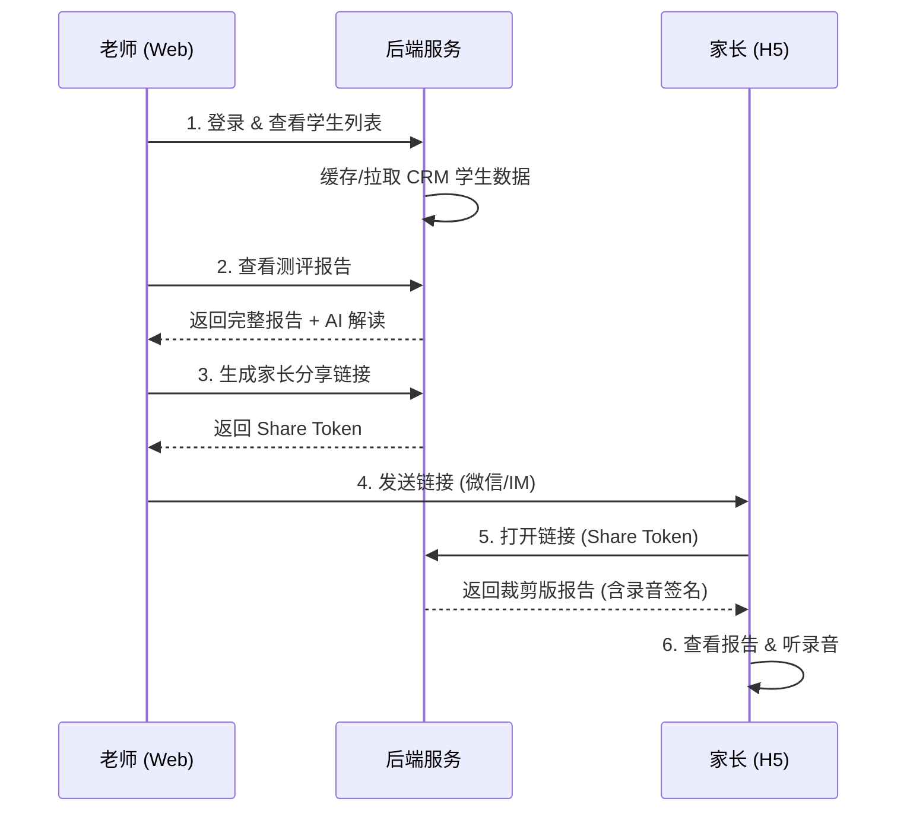
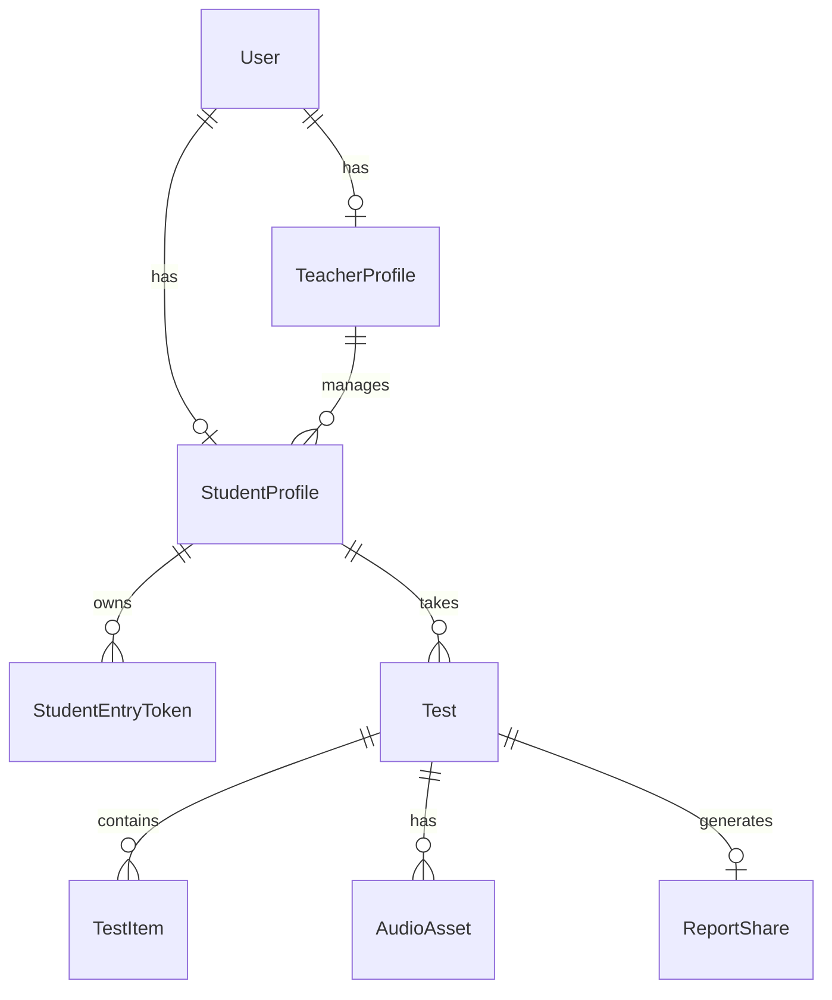

# PRD v1.0 Production｜口语测评系统

> **学生端测评 + 老师端报告/解读 + 家长端查看**

---

## 1. 背景与目标

我们要把“口语测评”从一次性的作业/工具，升级为可复用的**学习数据资产**与**增长经营能力**：让老师能规模化组织测评、让家长能快速理解与被说服、让运营能用统一口径做分层与转化复盘，形成「测评即证据、结果即行动、数据即闭环」的端到端系统。

### 1.1 业务背景（Why now）

- 组织口测成本高：统计、解释高度依赖老师个人能力，难规模化复制
- 结果缺少“可信证据”：只有分数不够，家长需要能对照、能解释的证据点
- 测评链路缺少经营视角：扫码→完成→评分→分享→打开→咨询/购买 的漏斗不可见，优化无从下手

### 1.2 产品愿景（从测评到经营闭环）

- **学生端**：低门槛进入、强引导作答、即时反馈降低挫败感，确保“能完成、愿意复测”
- **老师端**：一屏掌控班级进度与异常，自动生成“可解释、可沟通、可复用”的报告与解读话术
- **家长端（H5）**：关键结论先给、证据点可回放，帮助老师把“分数”转成“行动”（练什么/怎么买/怎么跟进）
- **运营治理（可选）**：统一口径的数据面板、分层策略、成本与 ROI 复盘，把经验变成可迭代的策略资产

### 1.3 方法论与度量框架（讲清楚怎么做对）

- **北极星指标（NSM）**：完成一次有效口测并被成功理解与使用（老师完成分享 + 家长有效阅读）的“有效测评闭环数”
- **漏斗/飞轮**：
  - 漏斗：扫码进入 → 完成录音 → 评分成功 → 老师分享 → 家长打开/停留 → 咨询/购买（可选）
  - 飞轮：更好体验 → 更高完成率 → 更好数据与证据 → 更强说服力 → 更高转化与复测 → 进一步优化体验
- **分层运营**：按能力水平/短板结构/进步幅度/置信度/触达行为做可解释分层，驱动差异化跟进策略
- **实验与迭代**：关键链路指标可观测，支持策略对比与 A/B 验证

### 1.4 本期目标（V1.0 Production）

构建**生产级、高可用、可扩展**的口语测评系统，支撑全校级并发使用，实现「学生口测 → 自动评分 → 报告生成 → 老师解读/分享 → 家长查看」的全链路闭环。

### 1.5 非功能性需求 (NFR) - 生产级标准

| 维度 | 指标 | 目标值 |
|------|------|--------|
| **高并发 (Concurrency)** | 系统吞吐量 (QPS) | 支持 **1000+ QPS** (峰值)；支持 **5000+** 学生同时在线作答 |
| **高可用 (Availability)** | 服务可用性 (SLA) | **99.9%** (月度不可用时间 < 43分钟) |
| **低延迟 (Latency)** | 接口响应时间 (P95) | 核心接口 < 200ms；Part 1 评测 < 500ms (流式) |
| **数据安全 (Security)** | 数据持久化 | RPO < 1分钟 (数据库主从 + 每日全量备份 + Binlog 实时备份) |
| **可观测性 (Observability)** | 监控覆盖率 | 核心链路 100% 覆盖 (Trace/Log/Metric)；报警响应 < 5分钟 |

### 成功标准 (V1.0)

- **链路可观测**：学生一次测试完成率、评分返回成功率、老师端报告生成成功率、分享率、家长端打开率与平均停留时长可追踪
- **资产可沉淀**：录音、转写、评分结果、报告可长期回看；音频与关键产物落在阿里云 OSS，便于复盘与质检
- **体验可规模化**：入口稳定、异常可提示、失败可重试；让“测评组织”从人肉流程变成可复制的系统能力

---

## 2. 用户与角色

本系统的价值链路是：**学生完成测评产出数据 → 老师把数据转成沟通与动作 → 家长被证据说服并形成决策 →（可选）运营用数据做分层、策略与 ROI 复盘**。因此我们同时服务“使用者”（老师/学生/家长）与“治理者”（运营）。

| 角色 | 说明 | 登录方式 |
|------|------|----------|
| **老师（班主任）** | 组织测评、读懂结果、完成对家长/学生的“解释与跟进”，把测评变成可执行动作 | `@51talk.com` 邮箱 + 验证码 |
| **学生** | 完成测评并获得即时反馈，降低紧张与操作失误，确保数据有效 | **1 人 1 码**：老师生成学生专属二维码/链接（带一次性 token），学生扫码进入 |
| **家长** | 在手机端快速理解孩子口语水平与证据点，形成“配合练/咨询/购买”等决策 | 无需登录，链接长期有效 |

### 2.1 用户画像（核心）

#### 画像 A：班主任 / 国内SS（销售）（主要使用者）

- **目标**：把口测从“费力的作业收集”升级为可规模化的**班级运营动作**：高效组织测评、快速拿到“可解释+可复用”的沟通素材，并推动家长理解与后续跟进
- **痛点**：
  - **组织成本高且不可控**：收作业、催交、统计、解释高度耗时，且随班级规模线性增长
  - **教学能力差异放大**：英语水平不齐，难以示范/纠正，学生易卡在“不会说/不敢说/说不完”
  - **沟通材料不够“可说服”**：只给分不够用，缺少能直接复用的要点、证据点与行动建议
  - **触达与回访难闭环**：链接分发后打开率/停留不可见，跟进节奏与优先级难排
- **典型场景**：
  - 周测/月测布置口语任务 → 课后查看完成情况、异常与班级概览 → 重点学生优先跟进
  - 家长会/个别沟通前，生成“解读版”要点（亮点/短板/证据/建议）→ 一键分享家长专属链接
- **关键需求**：
  - **班级可视化看板**：学生列表/搜索、完成状态、异常（失败/低置信度/噪音）与可跟进的优先级提示
  - **可解释报告**：总分/分项/证据点（转写摘录、错读词、典型例句），让“为什么这样评”讲得清

#### 画像 B：学生（被测者）

- **目标**：用最少步骤完成测评并获得即时反馈，把“紧张与不确定”变成“知道下一步怎么练”，提升完成率与数据有效性
- **痛点**：
  - **进入门槛与环境干扰**：入口难找/登录麻烦；设备与网络不稳定导致反复录音
  - **作答不确定性**：不知道怎么说、说到一半被打断、环境噪音影响评分与信心
- **典型场景**：
  - 在家用手机扫码进入 → 连续完成 Part1+Part2 → 立即看到简要结果与练习建议
- **关键需求**：
  - **1 人 1 码直达**：清晰的录音引导/示例与倒计时，降低操作错误
  - **过程可控**：上传/评分进度可视化；失败可重试（带次数/时限策略）
  - **反馈聚焦**：简要结果只给 1-3 个“下一步怎么练”，避免信息过载

#### 画像 C：家长（报告阅读者）

- **目标**：在手机端快速理解孩子口语水平与短板，看到“可回放的证据”，并获得可执行的家庭配合方案（练什么、怎么练、练多久）
- **痛点**：
  - **信息不可理解**：报告过于技术化；只给分不讲原因；不知道该练什么
  - **证据不可验证**：手机端阅读不友好；无法回放/对照孩子说了什么，信任感不足
- **典型场景**：
  - 收到老师分享链接 → 用手机打开 → 先看结论再看证据（听录音/看转写）→ 决定是否配合练/咨询（可选）
- **关键需求**：
  - **移动端友好**：H5 适配、加载快、无需登录；关键结论先呈现（分数+星级+短板）
  - **证据可回放**：可回放录音；可选展示 Part2 转写（保护隐私可开关）
  - **行动建议可执行**：对应的行动建议（每周练习清单/注意点）

#### 画像 D：运营管理人员（管理与质量视角，可选）

- **目标**：把口测从“单次测评”升级为可复用的**经营决策引擎**——以升舱转化为牵引，建立从**人群分层 → 策略触达 → 转化闭环 → 复盘迭代**的可规模化运营体系；在体验与效果不打折的前提下，基于**单位经济模型**（单次测评成本/触达成本/人工成本/边际成本）做精细化成本治理；用统一口径的**漏斗与归因**衡量并持续提升整体 **ROI**
- **痛点**：
  - **决策缺乏“可解释+可执行”抓手**：口语能力没有形成稳定的分层框架与推荐逻辑，难把“分数”转成“升舱动作”（谁该推、推什么、何时推、为什么推）
  - **增长链路未形成闭环**：测评→老师分享→家长打开/停留→咨询/购买缺少端到端漏斗与统一口径，无法做策略对比与 A/B 验证，经验难沉淀
  - **成本结构不透明、预算难控**：测评成本、触达成本、人工复核/客服成本缺少分摊规则与单位成本核算，难做预算、上限控制与边际效率评估
  - **ROI 归因与复盘缺位**：不同渠道/老师/班级/时间窗口的转化贡献难归因，ROI 波动无法解释，优质策略难复制、劣质策略难止损
  - **质量治理体系薄弱**：异常样本（噪音、低置信度、代录/作弊、模型异常）缺少抽检入口与问题闭环；模型/Prompt/规则迭代后缺少版本追溯，历史对齐困难
- **典型场景**：
  - 基于口测结果做**升舱人群筛选**（例如达到阈值/进步显著/短板明确）→ 导出名单 → 触达转化
  - 看运营漏斗与成本看板（完成率、评分成功率、老师分享率、家长打开率/停留、单位测评成本）→ 调整触达与测评策略
  - 处理异常与投诉：抽检录音/转写/评分证据点 → 回溯模型版本与当时配置
- **关键需求**：
  - **升舱分层与规则**：可配置的分层/阈值（按总分/分项/进步幅度/置信度等）与“推荐理由”（可解释）
  - **人群筛选与导出**（可选）：按时间/班级/老师/渠道筛选，导出升舱名单与核心指标（用于触达）
  - **漏斗与 ROI/成本看板**（可选）：关键转化链路指标 + 单位测评成本/触达成本/人工复核成本的监控与对比
  - **质量抽检与追溯**（可选）：听录音/看转写/看评分证据点；标注问题类型；模型版本/Prompt/配置变更可追溯

---

## 3. 系统架构

### 3.1 总体架构图



### 3.2 部署架构与资源规划 (Deployment Architecture)

为满足 V1.0 生产级目标（1000+ QPS, 99.9% 可用性），采用 **“PaaS 中间件 + ECS 计算节点”** 的高可用架构。

#### 3.2.1 资源清单 (Resource Bill of Materials)

| 组件类型 | 角色 | 数量 (最小集) | 规格建议 | 说明 |
| :--- | :--- | :--- | :--- | :--- |
| **计算资源 (ECS)** | **API 服务节点** | **2 台** | 4C8G / 8C16G | **核心后端**。部署 Node.js/Python 服务，处理业务逻辑。多节点互为备份。 |
| **计算资源 (ECS)** | **Worker 节点** | **2 台** | 4C8G | **异步消费者**。处理 Part 2 耗时任务（上传/Qwen调用）。建议与 API 分离，防止阻塞。 |
| **网络资源** | **SLB (负载均衡)** | **1 个** | 性能保障型 | 分发流量至 API 节点，健康检查自动剔除故障节点。 |
| **网络资源** | **CDN** | - | 按量付费 | **前端托管**。H5 静态资源 (HTML/JS/CSS) 部署于 OSS + CDN，不占用 ECS 资源。 |
| **PaaS 服务** | **RDS MySQL** | **1 套** | 高可用版 (HA) | **主备架构**。支持自动故障切换，保障数据 RPO/RTO。 |
| **PaaS 服务** | **Redis** | **1 套** | 标准版/集群版 | 缓存 Token、热点数据、接口限流计数。 |
| **PaaS 服务** | **RocketMQ** | **1 套** | 标准版 | 削峰填谷，承载 Part 2 异步任务队列。 |
| **PaaS 服务** | **OSS** | - | 按量付费 | 存储音频文件、前端静态资源。 |

#### 3.2.2 部署拓扑图



---

## 4. 产品范围（本期）

### 3.1 测试结构（固定口径）

| Part | 名称 | 分值 | 说明 |
|------|------|------|------|
| Part 1 | 词汇朗读 | 20 分 | 一次录音覆盖全部词汇 |
| Part 2 | 问答表达 | 24 分 | 12 题，每题 0/1/2 分 |
| **总计** | - | **44 分** | - |

- **评分引擎**：Part1=讯飞语音评测（流式版；WebSocket 流式），Part2=Qwen-Omni（本期不接入 Gemini/其他模型）

### 3.2 评分引擎（更新）

| 引擎 | 用途 | 状态 |
|------|------|------|
| **讯飞语音评测（流式版；WebSocket 流式）** | Part1 词汇朗读评测（精准发音评分） | ✅ 已对接 |
| **阿里云 Qwen-Omni** | Part2 问答表达评测（语义理解+评分） | ✅ 已验证 |

> **技术方案更新**：经实测验证，阿里云 Qwen-Omni 模型能够直接理解音频内容并给出评测反馈，适合用于 Part2 的语义评测场景。

### 3.3 输出物

#### 学生端（即时简要结果）

- **Part1 得分**（词汇朗读分）：即时展示，作为“基础分”反馈
- **行动引导**：文案提示“完整报告（含总分、星级与专家建议）已生成，请联系班主任获取”
- **不展示**：总分、星级、Part2 得分（避免等待焦虑，增强老师价值）

#### 老师端（完整报告）

- 总分/维度分/分项明细（按 Part 展示）
- **Part1**：词汇正确/需改进清单、典型错读点或「相似音」提示
- **Part2**：12 题逐题得分与评语（Qwen-Omni 输出）
- **Part2 转写**：展示逐字转写（用于证据点/沟通与质检）
- 录音回放（原始 + mp3）

#### 老师端（解读版）

- **生成方式**：模型生成，允许引用学生转写作为证据点
- **家长沟通话术**：亮点、短板、证据点（引用报告片段/示例/转写摘录）、行动建议（1 周练习计划）
- **风险提示**：如录音环境差导致的置信度下降说明（若可判断）

#### 家长端（专属链接）

- 展示完整报告（**不展示解读版**）
- 可展示 Part2 逐字转写（可配置开关）
- 适配手机端阅读与分享

---

## 4. 核心流程

### 4.1 学生端流程

```
扫码进入（学生专属二维码/链接）→ 进入本次测试（Level/Unit）→ 录音(Part1+Part2) → 提交 → 等待评分 → 查看简要结果
```

1. 扫码进入：访问 `/s/{token}`（token 与某个 `student_id` 绑定；过期/已使用/已作废则提示联系老师）
2. 进入本次测试（按老师布置的 Level/Unit；或 token 直接绑定到固定 Level/Unit）
3. 录音：
   - **Part1**：一次作答覆盖全部词汇；**讯飞语音评测（流式版）采用 WebSocket 流式评测**（音频按帧/分片推送；可边录边推或录完后从文件分片推流）
   - **Part2**：**整段录音一次上传**（12 题连续作答，不逐题分割）
4. 提交
5. 后端并行触发评测：
   - **Part1**：调用讯飞语音评测（流式版）**WebSocket 流式**评测（发音/流利/完整度等维度）
   - **Part2**：调用 Qwen-Omni 评测（整段音频一次评：转写 + 12 题逐题 0/1/2 + 评语/建议）
6. **展示简要结果**：
   - 显示 Part1 得分（如 18/20）
   - 提示联系老师获取完整报告

### 4.2 老师端流程

```
邮箱验证码登录 → 学生列表 → 查看报告+解读版 → 复制家长链接 → 跟进备注(可选)
```

1. 邮箱验证码登录（仅允许 `@51talk.com`）
2. 学生列表/搜索
3. 查看某次测评：完整报告 + 解读版
4. 获取家长专属链接：复制/生成二维码（可选）
5. 跟进备注（可选）：记录与家长沟通结论

### 4.3 家长端流程（H5）

```
打开专属链接 → 查看报告 → 回放录音 → 分享(可选)
```

1. 打开专属链接
2. 查看报告（可回放录音）
3. 下载/分享「报告图片/PDF」为可选项
4. 无有效期限制

### 4.4 核心业务时序图

#### 4.4.1 学生测评流



#### 4.4.2 老师分享与家长查看流



---

## 5. 讯飞语音评测（流式版）接口

> 参考文档：[语音评测（流式版）API 文档](http://xfyun.cn/doc/Ise/IseAPI.html)

### 5.1 接口概述

| 项目 | 说明 |
|------|------|
| **产品名称** | 语音评测（流式版） |
| **调用方式** | **WebSocket 流式**（wss；音频按帧/分片发送） |
| **请求地址** | `wss://ise-api.xfyun.cn/v2/open-ise` |
| **鉴权方式** | 签名机制（HMAC-SHA256；URL 携带 `authorization/host/date`） |
| **音频属性** | 采样率 16k/8k、位长 16bit/8bit、单声道 |
| **音频格式** | pcm、wav、mp3（需设置 `aue=lame`）、speex-wb |
| **限制** | 音频数据发送会话时长 ≤ 5 分钟（以官方限制为准） |
| **支持语言** | 中文、英语、日语、韩语、法语、德语、俄语、西班牙语 |
| **响应格式** | JSON |

> 说明：控制台里的「语音评测（流式版）」就是通过 **WebSocket 流式**调用的语音评测能力；PRD 统一按该命名。

### 5.1.1 实现必须确认的关键参数（避免对接返工）

讯飞语音评测（流式版）除鉴权与音频外，还需要明确业务参数口径（以官方文档为准）：

- **评测类型**：如 `category`（单词/句子/段落等）与对应 `ent`/子类型配置
- **参考文本**：必须明确 `text`（评测用参考稿）如何拼接与编码（如 `tte`）
- **音频参数**：如 `aue`（编码类型，mp3 常用 `lame`）与 `auf`（采样率/位宽/声道）等
- **逐词输出能力**：是否支持“一次评测输出逐词/音素分”（用于 Part1 词汇清单）；若不支持，需要调整为逐词评测或分段评测

### 5.2 评测能力

语音评测（流式版）基于深度神经网络，提供：
- 发音水平分析
- 发音错误定位
- 缺陷定位与问题分析
- 全面分析发音、语调、语速等要素

### 5.3 预期返回字段（待实际对接确认）

| 字段 | 说明 | 用途 |
|------|------|------|
| `total_score` | 总分 | 直接展示 |
| `pronunciation` | 发音得分 | 报告维度 |
| `fluency` | 流利度得分 | 报告维度 |
| `integrity` / `completeness` | 完整度得分 | 报告维度 |
| `accuracy` | 准确度得分 | 报告维度 |
| `rec_result` / `asr_result` | 识别文本 | 质检/对照（非 Part2 默认评分依据） |
| 逐词/音素得分 | 词级别错误标注 | Part1 词汇正确/错误清单 |
| `duration` | 音频时长 | 统计 |

### 5.4 Part2 评分策略

#### 方案 A：讯飞语音评测（流式版） + rubric（备选，不作为 MVP 默认）

由于 Part2 采用 **整段录音一次上传**，讯飞不会直接返回「12 题逐题 0/1/2」：

```
录音上传 → 讯飞返回(总分+维度+ASR文本) → 后端用 ASR 文本 + rubric 计算逐题分
```

- **ASR 文本**：讯飞返回的语音转写结果
- **Rubric**：预定义的 12 题评分规则（关键词/句型匹配）
- **逐题 0/1/2**：后端根据 ASR 文本与 rubric 计算

#### 方案 B：Qwen-Omni 直接评测（推荐）✅

Qwen-Omni 可以直接理解音频内容并进行语义评测：

```
录音上传 → Qwen-Omni 返回(转写+评分+评语+建议) → 直接使用
```

**优势**：
- 无需预定义 rubric 规则，模型自动理解语义
- 端到端评测，减少调用链路
- 可生成个性化反馈和改进建议
- 成本更低（约 ¥0.003/次）

**实测效果**：
- 输入：学生录音 + 测试题目 + 参考答案
- 输出：转写文本、多维度评分（发音/语法/流利度/内容）、问题分析、改进建议

### 5.5 官方 Demo

- [Java Demo](https://xfyun-doc.xfyun.cn/lcdp-doc/1739518045259325440) 
- [Python Demo](https://xfyun-doc.xfyun.cn/lcdp-doc/1739518106697568256)

---

## 6. 阿里云 Qwen-Omni 评测方案（Part2）

> **验证状态**：✅ 已通过实测验证，可正常识别音频并生成评测报告

### 6.1 接口概述

| 项目 | 说明 |
|------|------|
| **产品名称** | 通义千问 Qwen-Omni |
| **模型** | `qwen3-omni-flash` (推荐) |
| **协议** | OpenAI 兼容 API（HTTPS） |
| **请求地址** | `https://dashscope.aliyuncs.com/compatible-mode/v1` |
| **鉴权方式** | API Key（Bearer Token） |
| **音频格式** | mp3, wav, flac, m4a, pcm |
| **音频大小** | 单文件 ≤ 20MB |
| **调用方式** | 必须使用流式调用（`stream=True`） |
| **限流 (Rate Limit)** | **60 RPM** (每分钟 60 次请求) |

### 6.2 核心能力

Qwen-Omni 是端到端的多模态大模型，具备：

- ✅ **音频理解**：直接理解音频内容，无需预先 ASR
- ✅ **语义评测**：基于上下文理解学生回答的内容完整性
- ✅ **发音分析**：识别发音问题并给出改进建议
- ✅ **语法纠错**：检测语法错误并给出正确表达
- ✅ **个性化反馈**：根据学生表现生成针对性建议

### 6.3 调用示例

```python
from openai import OpenAI
import base64

client = OpenAI(
    api_key="your-api-key",
    base_url="https://dashscope.aliyuncs.com/compatible-mode/v1"
)

# 加载音频并构建 data URL
with open("audio.mp3", "rb") as f:
    audio_base64 = base64.b64encode(f.read()).decode()
data_url = f"data:audio/mpeg;base64,{audio_base64}"

# 调用 API（必须流式）
completion = client.chat.completions.create(
    model="qwen-omni-turbo",
    messages=[
        {
            "role": "system",
            "content": "你是一位专业的英语口语评测老师..."
        },
        {
            "role": "user",
            "content": [
                {
                    "type": "input_audio",
                    "input_audio": {
                        "data": data_url,  # data URL 格式
                        "format": "mp3"
                    }
                },
                {
                    "type": "text",
                    "text": "请评测这段英语口语..."
                }
            ]
        }
    ],
    modalities=["text"],  # 只输出文本
    stream=True,
    stream_options={"include_usage": True}
)

# 收集流式响应
for chunk in completion:
    if chunk.choices and chunk.choices[0].delta.content:
        print(chunk.choices[0].delta.content, end="")
```

### 6.4 Part2 评测 Prompt 模板（整段音频一次评测，输出逐题 0/1/2）

```
你是一位专业的英语口语评测老师。现在给你一段学生完成 Part2（12 题连续作答）的整段录音。

输入给你的文本会包含：
- 题目列表（1-12，每题题干）
- 每题参考答案/要点（可为空）

请你完成：
1) 输出整段逐字转写（尽量保留原话，不要润色）
2) 对 1-12 每题分别给出 0/1/2 分（必须齐全 12 题，不允许缺题、不允许改题号）
3) 每题给出 1-2 句“为什么给这个分”的理由（围绕内容是否正确/完整）
4) 给出全局的 1-3 条改进建议（可操作）

严格只输出 JSON（不要输出 markdown），JSON 结构如下：
{
  "transcript_full": "string",
  "items": [
    {
      "no": 1,
      "score_0_2": 0,
      "reason": "string",
      "evidence": "string",
      "suggestion": "string"
    }
    // ... 必须包含 no=1..12 共 12 条，且按题号升序
  ],
  "overall_suggestion": ["string", "string"]
}

注意：
- 若学生某题明显未作答/听不清：该题 score_0_2=0，并在 reason 里说明“未作答/无法辨识”
- evidence 尽量引用 transcript_full 中对应的原句片段（用于报告证据点）
```

### 6.5 成本估算 (Cost Estimation)

> **计费标准** (单位：元/百万 Tokens)
> - **输入 (音频)**: ¥15.8
> - **输入 (文本)**: ¥1.8
> - **输出 (文本)**: ¥12.7 (当输入包含音频时)

| 模型 | 输入 (音频) | 输出 (文本) | 说明 |
|------|-----------|-----------|------|
| `qwen3-omni-flash` | ¥15.8/百万 | ¥12.7/百万 | 最新版，速度快，性价比高 |

**单次评测成本估算**：
- 输入：约 400 tokens (主要是音频) ≈ ¥0.0063
- 输出：约 300 tokens (评测结果) ≈ ¥0.0038
- **单次成本**：约 **¥0.01 (1 分钱)**

**月度成本估算**（1000 学生 × 4 次/月）：
- 4000 次评测 × ¥0.01 = **¥40/月**

### 6.6 与讯飞语音评测（流式版）的分工

| 场景 | 推荐引擎 | 原因 |
|------|----------|------|
| **Part1 词汇朗读** | 讯飞语音评测（流式版） | 音素级发音评分更精准，支持逐词评分 |
| **Part2 问答表达** | Qwen-Omni | 语义理解能力强，可评估回答内容是否正确 |
| **录音转写** | Qwen-Omni | 端到端 ASR + 评测，减少调用链路 |
| **个性化反馈** | Qwen-Omni | 可根据学生表现生成针对性建议 |

---

## 7. 评分与展示规则

### 7.1 分数来源

| Part | 分数来源 | 说明 |
|------|----------|------|
| Part1 | 讯飞语音评测（流式版）朗读评测 | 映射为 0–20（映射公式/分段需确定） |
| Part2 | **Qwen-Omni 语义评测**（推荐） | **逐题输出 12 题 0/1/2（必要）**；Part2 总分 = 12 题求和（0–24） |
| Part2 | 讯飞 ASR + rubric（备选） | 需预定义 rubric 规则 |

#### Part2 评分映射规则（仅当模型输出为 1-10 时启用，默认不启用）

若模型（或兜底策略）只能返回某题的 1-10 分，则按以下规则映射为 0/1/2：

| Qwen-Omni 得分 | 映射分数 | 说明 |
|----------------|----------|------|
| 8-10 | 2 分 | 回答完整、发音准确 |
| 5-7 | 1 分 | 回答基本正确，有小问题 |
| 1-4 | 0 分 | 回答错误或无法理解 |

### 7.2 星级规则

按总分百分比映射：`pct = score / 44`

| 百分比 | 星级 |
|--------|------|
| 90%+ | ⭐⭐⭐⭐⭐ 5 星 |
| 80–89% | ⭐⭐⭐⭐ 4 星 |
| 65–79% | ⭐⭐⭐ 3 星 |
| 50–64% | ⭐⭐ 2 星 |
| <50% | ⭐ 1 星 |

> 可按教研口径调整

---

## 8. 功能需求（按端拆分）

### 8.1 学生端（Must）

- [ ] 学生入口：**1 人 1 码**（扫码/打开链接进入；token 过期/已使用/作废提示）
- [ ] 测试页：题目展示、录音、提交
- [ ] 结果页（简要）：**仅展示 Part1 得分**；**引导找老师看完整报告**（不展示总分/星级）
- [ ] 历史记录（可选）：本人最近 N 次

### 8.2 老师端（Must）

- [ ] `@51talk.com` 邮箱验证码登录
- [ ] 学生列表对接（MVP，默认方案）：对接现有「国内 SS 学生列表」接口，按老师邮箱拉取名下学生（支持分页/搜索）
  - 输入：`ss_email_addr`（老师邮箱）
  - 输出字段（示例）：`user_id`、`real_name`、`cur_age`、`cur_grade`、`cur_level_desc`、`main_last_buy_unit_name`、`is_upgrade`、`ss_group`、`ss_sm_name`、`ss_dept4_name` 等
  - 策略：服务端按需拉取 + 缓存（如 10-30 分钟）+ 支持“刷新”按钮（避免强依赖实时接口稳定性）
  - 兜底：如接口不可用，允许导入 CSV（仅用于临时试点；字段以 `user_id + real_name` 为最小集）
- [ ] 学生入口码（1 人 1 码）：为学生生成**专属二维码/链接**（支持批量导出/打印；支持作废重置）
- [ ] 报告列表与详情：完整报告、解读版
- [ ] 生成家长专属链接（永久有效）
- [ ] 复制链接/二维码（二维码可选）

### 8.3 家长端（Must）

- [ ] **无需登录**：通过老师分享的加密链接 (`/p/{token}`) 直接访问。
- [ ] **状态兼容**：
  - 若 Part 2 正在排队/分析中，页面展示 **"AI 正在深度分析中，请稍后..."** 及 Part 1 成绩。
  - 若已完成，展示完整报告。
- [ ] **报告查看**：
  - 听录音（Part 1 & Part 2）
  - 看五维图、评语、建议

---

## 9. 数据模型 (Production Schema)

### 9.1 数据实体关系图 (ERD)



### 9.2 核心表结构定义

> **规范**：所有表必须包含 `created_at`, `updated_at`；逻辑删除字段 `is_deleted` (可选)；主键推荐使用 `BigInt` 自增或 `Snowflake ID`。

#### 1. User (用户基础表)
- **Indexes**: `uk_email`
- **Constraints**: `role IN ('teacher', 'student', 'admin')`

```sql
CREATE TABLE users (
    id BIGINT PRIMARY KEY,
    role VARCHAR(20) NOT NULL, -- teacher, student, admin
    email VARCHAR(100), -- 仅老师/管理员有
    status TINYINT DEFAULT 1, -- 1:active, 0:disabled
    created_at TIMESTAMP DEFAULT CURRENT_TIMESTAMP,
    updated_at TIMESTAMP DEFAULT CURRENT_TIMESTAMP ON UPDATE CURRENT_TIMESTAMP,
    UNIQUE KEY uk_email (email)
);
```

#### 2. StudentProfile (学生档案)
- **Indexes**: `idx_teacher_id`, `idx_external_user_id`

```sql
CREATE TABLE student_profiles (
    user_id BIGINT PRIMARY KEY,
    student_name VARCHAR(50) NOT NULL,
    external_source VARCHAR(20) DEFAULT 'crm_domestic_ss',
    external_user_id VARCHAR(50), -- CRM 中的 ID
    teacher_id BIGINT NOT NULL, -- 关联 users.id (Teacher)
    ss_email_addr VARCHAR(100), -- 冗余字段，用于快速校验
    -- 冗余 CRM 字段 (用于展示与筛选)
    cur_age INT,
    cur_grade VARCHAR(20),
    cur_level_desc VARCHAR(50),
    last_synced_at TIMESTAMP,
    INDEX idx_teacher_id (teacher_id),
    INDEX idx_external_user_id (external_user_id)
);
```

#### 3. Test (测评记录主表)
- **Indexes**: `idx_student_id`, `idx_created_at`

```sql
CREATE TABLE tests (
    id BIGINT PRIMARY KEY,
    student_id BIGINT NOT NULL,
    level VARCHAR(20) NOT NULL,
    unit VARCHAR(20) NOT NULL,
    status VARCHAR(20) NOT NULL, -- pending, processing, completed, failed
    total_score DECIMAL(5,2), -- Part1 + Part2
    part1_score DECIMAL(5,2),
    part2_score DECIMAL(5,2),
    star_level TINYINT, -- 1-5
    part2_transcript TEXT, -- Qwen 转写结果
    failure_reason VARCHAR(255),
    created_at TIMESTAMP DEFAULT CURRENT_TIMESTAMP,
    INDEX idx_student_id (student_id),
    INDEX idx_status (status)
);
```

#### 4. TestItem (Part2 题目明细)
- **Indexes**: `idx_test_id`

```sql
CREATE TABLE test_items (
    id BIGINT PRIMARY KEY,
    test_id BIGINT NOT NULL,
    question_no INT NOT NULL, -- 1-12
    score TINYINT NOT NULL, -- 0, 1, 2
    feedback TEXT, -- 单题评语
    transcript_segment TEXT, -- 该题对应的转写片段
    UNIQUE KEY uk_test_question (test_id, question_no)
);
```

#### 5. StudentEntryToken (入口令牌)
- **Indexes**: `uk_token`, `idx_student_id`

```sql
CREATE TABLE student_entry_tokens (
    id BIGINT PRIMARY KEY,
    token VARCHAR(64) NOT NULL,
    student_id BIGINT NOT NULL,
    expires_at TIMESTAMP NOT NULL,
    is_used TINYINT DEFAULT 0,
    used_at TIMESTAMP,
    created_by BIGINT, -- 老师 ID
    UNIQUE KEY uk_token (token),
    INDEX idx_student_id (student_id)
);
```

#### 6. ReportShareToken (报告分享令牌 - 新增)
- **用途**：生成家长专属的查看链接，支持设置有效期。
- **Indexes**: `uk_token`, `idx_test_id`

```sql
CREATE TABLE report_share_tokens (
    id BIGINT PRIMARY KEY,
    token VARCHAR(64) NOT NULL,
    test_id BIGINT NOT NULL,
    expires_at TIMESTAMP, -- 可选，NULL 表示永久有效
    is_revoked TINYINT DEFAULT 0, -- 老师可手动撤回
    created_at TIMESTAMP DEFAULT CURRENT_TIMESTAMP,
    UNIQUE KEY uk_token (token),
    INDEX idx_test_id (test_id)
);
```

#### 7. AuditLog (审计日志 - 新增)
- **用途**：记录敏感操作（如生成 Token、查看报告、重置任务）

```sql
CREATE TABLE audit_logs (
    id BIGINT PRIMARY KEY,
    operator_id BIGINT NOT NULL, -- 操作人
    action VARCHAR(50) NOT NULL, -- e.g., GENERATE_TOKEN, VIEW_REPORT
    target_id BIGINT, -- 被操作对象 ID (如 student_id, test_id)
    client_ip VARCHAR(45),
    details JSON, -- 变更详情
    created_at TIMESTAMP DEFAULT CURRENT_TIMESTAMP,
    INDEX idx_operator (operator_id),
    INDEX idx_action (action)
);
```

---

## 10. OSS 方案

### 存储内容

- ✅ 原始录音（webm/wav）
- ✅ 转码后 mp3（用于回放/下载；**讯飞评测输入在后端转为 PCM 后按 WebSocket 流式推送**，无需单独落库）

### 音频格式要求（讯飞语音评测（流式版））

| 参数 | 要求 |
|------|------|
| 输入方式 | WebSocket **流式**（音频分片 base64 推送） |
| 编码 | PCM（如 16kHz/16bit/mono；以官方文档为准） |
| 格式 | pcm / wav / mp3（`aue=lame`）/ speex-wb（以官方文档为准） |
| 限制 | 音频数据发送会话时长 ≤ 5 分钟（以官方限制为准） |

### 上传策略

- **推荐**：后端签名 + 前端直传（减轻后端带宽）
- 备选：后端直传 OSS

### 访问策略

- **私有桶 + 后端生成短时签名 URL**
- 即便「链接永久有效」，音频 URL 仍需时效性签名（防泄露）

### 目录规范

```
speakingtest/
└── {env}/                    # prod / staging / dev
    └── {studentId}/
        └── {testId}/
            ├── part1/
            │   ├── raw.webm
            │   └── audio.mp3
            └── part2/
                ├── raw.webm
                └── audio.mp3
```

### 保留策略

- 录音文件：**OSS 生命周期 6 个月**（由 OSS bucket lifecycle 规则配置；过期后对象被删除）
- 转写/评分/报告结构化数据：**允许永久保留**（与家长链接永久有效一致）
- 家长端展示降级：
  - 录音未过期：可播放（短时签名 URL）
  - 录音已过期：提示「录音已过期，仍可查看评分与转写」并隐藏播放入口
- 支持「按学生删除」能力（GDPR/隐私合规：删除转写/评分/分享链接记录；并触发 OSS 删除/加速清理）

---

## 11. 接口清单 (V1.0 Production)

### 11.1 接口规范 (Standard)

- **Rate Limiting**: 所有接口响应头包含 `X-RateLimit-Limit`, `X-RateLimit-Remaining`, `X-RateLimit-Reset`
- **Error Codes**:
  - `200 OK`: 成功
  - `400 Bad Request`: 参数错误
  - `401 Unauthorized`: 未登录/Token 过期
  - `403 Forbidden`: 越权访问 (如老师访问非名下学生)
  - `429 Too Many Requests`: 触发限流
  - `503 Service Unavailable`: 服务降级/维护中

### 11.2 Auth

| Method | Path | 说明 |
|--------|------|------|
| POST | `/auth/teacher/request-code` | 发送验证码（仅 51talk 邮箱） |
| POST | `/auth/teacher/login` | 老师登录 |
| GET | `/s/{token}` | 学生入口页（H5 路由；后端可返回页面或做前端重定向） |
| POST | `/auth/student/entry/verify` | 校验学生入口 token（返回 student 会话/JWT + 允许进入的测试信息） |

### Test

| Method | Path | 说明 |
|--------|------|------|
| GET | `/questions` | 获取题目（level, unit；题库源为 JSON 文件，后续可迁移 DB） |
| POST | `/tests` | 创建测试 |
| POST | `/tests/{id}/upload-urls` | 获取 OSS 上传签名（raw+mp3） |
| POST | `/tests/{id}/submit` | 提交，触发评测（Part1=讯飞 + Part2=Qwen，后台并行） |
| GET | `/tests/{id}` | 获取结果（按权限裁剪） |

### 内部流程（后端评测）

#### Part1 流程（讯飞语音评测（流式版））

```
POST /tests/{id}/submit-part1
    ↓
1. 从 OSS 获取原始录音（webm/wav）或 mp3，并**转为评测所需的 PCM**（如 16k/16bit/mono，按讯飞文档为准）
2. 建立 WebSocket 连接到讯飞语音评测（流式版）
   wss://ise-api.xfyun.cn/v2/open-ise
3. **按帧/分片流式发送音频**（base64；首/中/末帧 status=0/1/2 等协议字段按讯飞文档），接收评测结果
4. 使用讯飞返回的维度分（发音/流利/完整度）
5. 映射为 0-20 分
6. 存储结果到数据库
```

#### Part2 流程（Qwen-Omni）✅ 推荐

```
POST /tests/{id}/submit-part2
    ↓
1. 从 OSS 获取 mp3 音频
2. 转换为 base64 + data URL 格式
3. 调用 Qwen-Omni API（流式）
   POST https://dashscope.aliyuncs.com/compatible-mode/v1/chat/completions
4. 传入：音频 + 题目 + 参考答案 + 评测 prompt
5. 接收：转写文本 + 多维度评分 + 改进建议
6. 映射 1-10 分为 0/1/2 分
7. 存储结果到数据库
8. 返回给前端
```

### Teacher

| Method | Path | 说明 |
|--------|------|------|
| GET | `/teacher/students` | 学生列表（默认从 CRM 学生列表接口拉取 + 缓存；支持分页/搜索/筛选） |
| POST | `/teacher/students/sync` | 手动刷新学生列表（触发后端重新拉取 CRM；用于兜底/排障） |
| POST | `/teacher/students/{id}/entry-token` | 生成/重置该学生入口 token（返回链接 + 二维码内容） |
| POST | `/teacher/students/{id}/tasks/{level}/{unit}/reset` | 重置该学生该任务测评（仅用于系统失败/运营批准场景；默认仅允许 1 次测评） |
| POST | `/teacher/students/entry-tokens/export` | 批量导出学生入口码（PDF/图片；可选） |
| GET | `/teacher/tests` | 测试列表（可筛选 studentId） |
| GET | `/teacher/tests/{id}/report` | 完整报告 |
| GET | `/teacher/tests/{id}/interpretation` | 解读版 |
| POST | `/teacher/tests/{id}/share` | 生成家长 token |
| POST | `/teacher/tests/{id}/share/reset` | 作废旧链接并重置 token（教师端操作） |

### Parent

| Method | Path | 说明 |
|--------|------|------|
| GET | `/p/{shareToken}` | 家长可见报告 |

### External (CRM / 国内 SS)

| Method | Path | 说明 |
|--------|------|------|
| GET | `/api/v1/domestic-ss/upgrade-28` | 单个学生查询（ss 邮箱必填；user_id 可选精确匹配） |

`/api/v1/domestic-ss/upgrade-28` 参数：

- `ss_email_addr`（query，required）：老师/SS 邮箱
- `user_id`（query，optional）：学生 user_id（用于精确匹配/校验归属）

响应（示例字段）：

- `data.user_id`
- `data.real_name`
- `data.cur_age`
- `data.cur_grade`
- `data.cur_level_desc`
- `data.main_last_buy_unit_name`
- `data.is_upgrade`
- `data.ss_name`
- `data.ss_sm_name`
- `data.ss_dept4_name`
- `data.ss_group`
- `data.ss_crm_name`
- `data.ss_email_addr`

---

## 12. 风险与约束

### 家长链接安全

- ⚠️ 链接永久有效，但仍建议：
  - token 足够长且不可枚举（建议 32 字符以上）
  - 报告接口限流、记录访问日志
  - 音频必须走签名 URL，避免永久公开

### 12.3 外部依赖风险 (External Dependencies)

- **API 并发瓶颈**：讯飞语音评测默认仅支持 50 路并发。
  - **影响**：若 1000 人同时考试，最后一名学生可能需等待 20 分钟。
  - **对策**：实施 **Waiting Room 排队机制** (见 13.3)；长期需购买企业级并发包扩容。

### RBAC（权限与越权控制）✅ 必须落地

- **角色**
  - `student`：仅能访问自己的学生会话内资源
  - `teacher`：仅能访问“归属到自己名下”的学生/测试资源（以 CRM/国内 SS 为准）
  - `admin`：全量访问（运营/排障）；所有重置操作需审计
  - `parent`：仅能通过 `/p/{shareToken}` 访问对应 `test_id` 的裁剪版报告
- **接口裁剪**
  - 老师端：可见完整报告、评分维度、逐题、转写；默认不可见学生敏感字段（手机号等）
  - 家长端：只展示**裁剪版完整报告**（不展示老师端“解读版”）；不暴露老师信息/内部组织字段；不提供“重新生成入口码/重测”等能力
  - 学生端：只展示当前测评流程必要信息；提交后可见简要结果（是否允许看逐题/转写按运营策略开关）
- **归属校验口径**
  - 老师查询/操作某 `student_id` 前：后端通过外部接口校验 `ss_email_addr == 当前登录老师邮箱`
  - 若前端传 `user_id`：用于“强一致校验”（不一致直接拒绝，避免错绑/越权）
- **审计**
  - 记录关键行为：生成/重置入口码、生成/重置家长链接、任务重置、查看报告（含 IP/UA/时间）

### 学生入口码安全（1 人 1 码）

- 入口 token 建议：**默认一次性**（used_at 后失效）+ **短有效期**（如 1-7 天；按运营节奏定）
- 支持老师端「作废/重置」入口 token（防止二维码被转发长期可用）
- 入口 token 仅用于识别 `student_id` 并建立会话，不应直接暴露学生敏感信息
- 建议记录 access 日志（IP/UA/时间），并对异常访问做限流

### 单次测评约束（按任务 level+unit）✅ 必须落地

- **目标口径**：同一学生对同一任务（`level + unit`）**默认仅允许 1 次有效测评**
- **约束维度**：以 `StudentTaskQuota(student_id, level, unit)` 为准，而不是“入口码 token 是否使用过”
- **何时占用名额**
  - 推荐：`POST /tests` 创建成功即把 quota 置为 `in_progress`（避免反复创建 test 绕过）
  - 当评测完成：置为 `completed`
- **失败与重置**
  - `failed_user`（用户原因）：如无录音/主动退出/明显无效音频 → **不允许重置**（仍算一次，或按运营策略定义为“无效不计入”但必须有明确判定规则）
  - `failed_system`（系统原因）：如讯飞/Qwen/OSS/转码超时或 5xx → **允许老师/运营重置**
  - 重置接口：`POST /teacher/students/{id}/tasks/{level}/{unit}/reset`
    - 行为：将 quota 回退为 `not_started`（或清空 `latest_test_id`），并记录 `last_reset_at/last_reset_by`
    - 频控：默认最多 1 次重置（可配置）；所有重置必须审计

### 录音过期与回放降级（6 个月）✅ 必须落地

- 录音对象按 OSS lifecycle 规则 6 个月删除
- 报告页获取音频：
  - 后端统一签名：`GET /tests/{id}` 返回 **短时签名 URL**（如 10-30 分钟）
  - 若对象已不存在：后端返回 `audioExpired=true`，前端隐藏播放并提示「录音已过期，仍可查看评分与转写」

### Part2 逐题评分

- **方案口径（已定）**：Part2 使用 **Qwen-Omni** 对**整段音频一次评测**，由模型输出「逐字转写 + 12 题逐题 0/1/2 + 评语/建议」。
- ⚠️ **风险**：逐题评分为模型基于整段内容的结构化输出，需要通过 prompt 约束与样本回归测试保障稳定性（尤其是跑题/漏题/题号错位）。
- ✅ **缓解**：后端做结构校验（必须含 1-12 题；缺失则重试/降级为整体分），并保留 raw 结果用于追溯质检。

### 讯飞语音评测（流式版）接口依赖

- ✅ 已确认使用讯飞语音评测（流式版）WebSocket 流式接口
- 待获取实际返回 JSON 样例以确定报告可展示字段
- 音频按讯飞协议做 **PCM 转码 + 分片（流式）发送**；会话时长 ≤ 5 分钟（以官方限制为准）

### 学生名单外部依赖（CRM/国内 SS 学生列表接口）

- ⚠️ 老师端学生列表依赖外部接口可用性与鉴权（需明确 token/header/白名单/网关策略）
- ✅ 缓解：后端做缓存（TTL）、失败降级（使用缓存兜底 + 提示“可手动刷新”）、记录拉取错误日志用于排障
- ✅ 建议：明确接口限流与分页上限，避免大区/大组老师名单过大导致超时

---

## 13. 里程碑

| 阶段 | 周期 | 内容 |
|------|------|------|
| **M1** | 1–2 周 | 登录（老师邮箱）+ 学生测评提交 + 讯飞跑通 + 学生简要结果 |
| **M2** | 1–2 周 | 老师端完整报告 + 解读版生成（先模板化）+ 家长专属链接 |
| **M3** | 1 周 | OSS 原始+mp3、私有播放、访问审计 |
| **M4** | 可选 | 学生登录方案、班级/名单导入、二维码、报告导出 |

---

## 13. 生产级高可用方案 (High Availability)

### 13.1 降级策略 (Fallback Strategy)

| 场景 | 触发条件 | 降级动作 | 恢复策略 |
|------|----------|----------|----------|
| **讯飞服务不可用** | WebSocket 连接失败 > 3次 或 响应超时 | **Part 1 自动跳过**，仅记录录音；前端提示“评分服务繁忙，稍后查看”；后端标记 `status=pending_retry` | 定时任务 (Cron) 每 5 分钟重试 `pending_retry` 任务 |
| **Qwen 服务不可用** | API 5xx 错误 或 超时 > 30s | **Part 2 转异步**；前端提示“AI 正在深度思考，请稍后查看报告”；后端放入死信队列 (DLQ) | 指数退避重试 (Exponential Backoff)；若持续失败 > 24h，报警人工介入 |
| **CRM 接口异常** | 接口超时/5xx | **使用本地缓存**；若无缓存，允许老师手动输入学生姓名（标记为 `unverified`） | 接口恢复后自动同步清洗数据 |

### 13.2 并发控制 (Concurrency Control)

- **Part 2 异步削峰**：
  - 学生提交后，音频上传 OSS，任务写入 `test_queue` (RabbitMQ/Kafka)。
  - 消费者服务 (Consumer) 根据 Qwen API 限流配额 (Quota) 拉取任务处理。
  - **关键约束**：`qwen3-omni-flash` 限流 **60 RPM**。Consumer 必须严格控制处理速率 **< 1 个/秒**，避免触发 429 错误。
  - **优势**：避免晚高峰千人并发导致 API 触发 429 限流，保障系统不崩。

- **数据库保护**：
  - 读写分离：老师端报表查询走 Read Replica。
  - 慢查询熔断：超过 3s 的统计查询自动熔断，返回缓存旧值。

### 13.3 Part 1 并发控制 (Waiting Room)

> **约束**：讯飞语音评测 API 默认并发限制为 **50 路**。为防止超限导致服务不可用，必须实施严格的排队机制。

- **令牌桶机制 (Token Bucket)**：
  - 后端维护全局计数器 (Redis Atomic)，最大允许 50 个活跃 Part 1 会话。
  - 学生点击“开始录音”时，申请令牌。
  - **有令牌**：进入录音页面，开始 WebSocket 推流。
  - **无令牌**：进入“排队室 (Waiting Room)”。

- **排队体验 (UX)**：
  - 界面提示：“当前考试人数较多，正在排队中（前方还有 N 人），预计等待 M 秒...”
  - 客户端每 3-5 秒轮询一次位置。
  - 获取令牌后自动进入录音，无需手动刷新。

---

## 14. 待确认事项

> 以下信息不影响先推进重写，但会影响「可实现的报告细节」

### 已确认 ✅

- [x] **讯飞具体用哪个接口/产品**：语音评测（流式版）（WebSocket）
- [x] **Part2 的录音策略**：整段录音一次上传
- [x] **Qwen-Omni API 可用性**：已验证，可正常识别音频并生成评测报告
- [x] **Qwen-Omni 调用方式**：必须使用流式调用（stream=True），音频使用 data URL 格式
- [x] **学生端登录/身份识别**：**1 人 1 码**（老师生成学生专属二维码/链接，扫码进入）

### 待后续确认

- [ ] 解读版模板的具体话术要求
- [ ] Part2 逐题输出格式校验规则（题号/字段）、失败重试与降级策略（缺题/跑题/噪声）
- [ ] 讯飞语音评测（流式版）实际返回 JSON 样例（用于确定报告可展示字段）
- [ ] Qwen-Omni 与讯飞语音评测（流式版）评分结果的对齐方案
- [ ] **Part1 评测类型与逐词输出**：ISE 的 `category/ent` 选型、`text`（参考文本）拼接规则、是否支持“一次评测输出逐词/音素分”；若不支持需改为逐词评测或分段评测
- [ ] CRM 学生列表接口：鉴权方式/必要请求头/网关白名单、限流与分页上限、字段口径（`user_id` 是否全局唯一且稳定）

---

## 附录 A：页面信息架构

### 学生端

```
/s/{token}               - 学生入口（扫码链接；识别 student 并进入测试）
/student/login           - 备用登录页（可选：输入 token/老师给的短码）
/student/test           - 测试页（选择 Level/Unit → 录音）
/student/result/{id}    - 简要结果页
/student/history        - 历史记录（可选）
```

### 老师端

```
/teacher/login          - 登录页
/teacher/dashboard      - 首页/学生列表
/teacher/student/{id}   - 学生详情/测试列表
/teacher/report/{id}    - 完整报告
/teacher/interpret/{id} - 解读版
```

### 家长端

```
/p/{token}              - 家长报告页（H5 适配）
```

---

## 附录 B：星级视觉参考

| 星级 | 视觉 | 说明 |
|------|------|------|
| 5 星 | ⭐⭐⭐⭐⭐ | 优秀 (90%+) |
| 4 星 | ⭐⭐⭐⭐☆ | 良好 (80-89%) |
| 3 星 | ⭐⭐⭐☆☆ | 中等 (65-79%) |
| 2 星 | ⭐⭐☆☆☆ | 需努力 (50-64%) |
| 1 星 | ⭐☆☆☆☆ | 待提升 (<50%) |

---

*文档版本：v1.0*  
*最后更新：2026-01-04*

---

## 变更记录

| 版本 | 日期 | 变更内容 |
|------|------|----------|
| v0.1 | 2025-12-28 | 初版，定义产品范围、讯飞语音评测（流式版）方案 |
| v0.2 | 2025-12-29 | 新增阿里云 Qwen-Omni 评测方案（第6章），验证通过；补齐外部单学生接口（upgrade-28）、RBAC/单次测评重置口径、录音 6 个月过期降级 |
| v1.0 | 2026-01-04 | **生产级发布**：全面升级为 V1.0 Production 标准（NFR/HA/Schema）；新增系统架构与部署架构图；优化学生端结果页体验（Part 1 即时反馈） |

